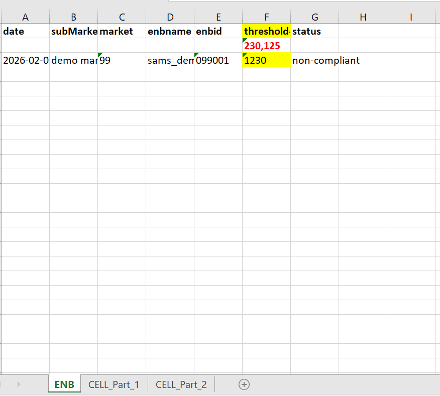

# Multi-Vendor LTE Configuration Compliance Analytics Platform

## Overview

Designed and developed a Python-based compliance analytics platform that automates LTE configuration audits across Samsung, Ericsson, and Nokia radio access networks (RAN). The platform validates network configurations against Golden Parameter Lists, identifies non-compliant network elements, generates exception reports, and produces compliance KPIs.

The solution was deployed to support wireless network operations and compliance initiatives across more than 125,000 network elements, reducing audit execution time from weeks to hours while improving consistency, accuracy, and traceability.

---

## Business Problem

Manual configuration audits across large-scale LTE networks are time-consuming, error-prone, and difficult to scale.

Engineers were required to manually compare network configuration parameters against approved baseline values across thousands of network elements, resulting in lengthy audit cycles and inconsistent reporting.

This project automated the entire compliance validation process.

---

## Solution Architecture

Samsung / Ericsson / Nokia OSS-NMS Systems

↓

Configuration Data Extraction

↓

Python Precheck & Validation

↓

ENB Audit

↓

CELL Part 1 Audit

↓

CELL Part 2 Audit

↓

Exception Identification

↓

Automated Excel Reporting

↓

Compliance KPI Generation

---

## Key Features

* Automated LTE configuration compliance validation
* Multi-vendor support (Samsung, Ericsson, Nokia)
* Golden Parameter List comparison engine
* Exception detection and reporting
* Automated Excel report generation
* KPI summary generation
* Scalable audit processing framework
* Vendor-specific audit workflows

---

## Technologies Used

* Python
* Pandas
* OpenPyXL
* XlsxWriter
* Excel Reporting Automation

---

## Platform Impact

* Supported Samsung, Ericsson, and Nokia LTE networks
* Audited 125,421+ network elements
* Identified 163 non-compliant configurations
* Achieved 99.87% configuration compliance rate
* Reduced audit execution time from weeks to hours
* Automated exception reporting and KPI generation

---

## Repository Contents

### Demo Implementation

This repository contains a sanitized Samsung demonstration workflow that illustrates the architecture and audit methodology used across all supported vendors.

Included components:

* Samsung ENB Audit
* Samsung CELL Part 1 Audit
* Samsung CELL Part 2 Audit
* Final Multi-Sheet Compliance Report Generator

The same framework was extended to Ericsson and Nokia environments as part of the production implementation.

---

## Sample Output

The platform generates:

* ENB Exception Reports
* CELL Part 1 Exception Reports
* CELL Part 2 Exception Reports
* Consolidated Multi-Sheet Audit Workbooks
* Compliance KPI Summaries
### Example Exception Report

Exception values are automatically highlighted and categorized to simplify engineering review and remediation activities.

---

## Author

Marthony Rigor

M.S. Data Science | Telecommunications Engineering | Data Analytics & Automation
